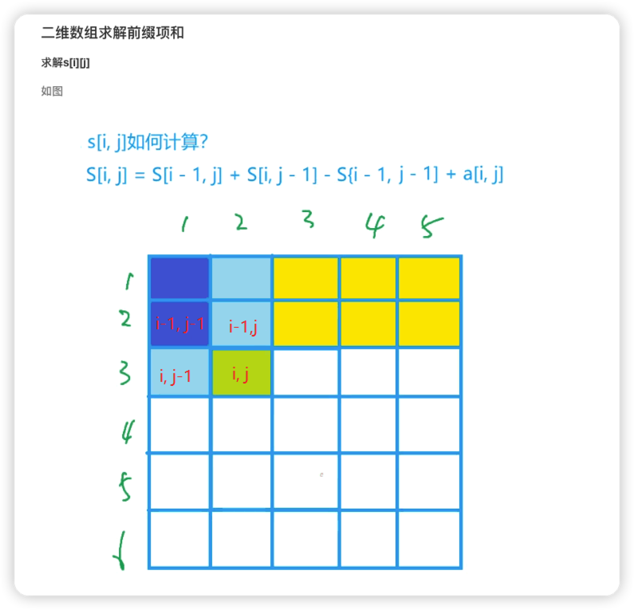

## 什么是前缀和
    - 原数组: a[1], a[2], a[3], a[4], a[5], …, a[n]
    - 前缀和 Si为数组的前 i项和
    - 前缀和: S[i] = a[1] + a[2] + a[3] + … + a[i]

### 一维数组前缀和

- 一维数组求解前缀和(Si)
  for循环求出 每个S[i] (将 S[0] 定义为 0, 避免下标的转换)
  求 [l, r]中的和, 即为 S[r] - S[l-1]

```python3
n, m = 10, 10
arr = []
sum = [0] * n
sum[0] = arr[0]
for i in range(1, n):
  sum[i] = sum[i - 1] + arr[i]
```

### 二维数组前缀和 主要是用来求一个最大的矩形区间和




```python3
n = m = 0
a = [[] for i in range(1)]
s = [[0] * (m + 1) for _ in range(n + 1)]
for i in range(1, n + 1):
  for j in range(1, m + 1):
    s[i][j] = s[i][j - 1] + s[i - 1][j] - s[i - 1][j - 1] + a[i][j]

x1, y1, x2, y2 = 0
res = s[x2][y2] - (s[x1 - 1][y2] + s[x2][y1 - 1] - s[x1 - 1][y1 - 1])
```