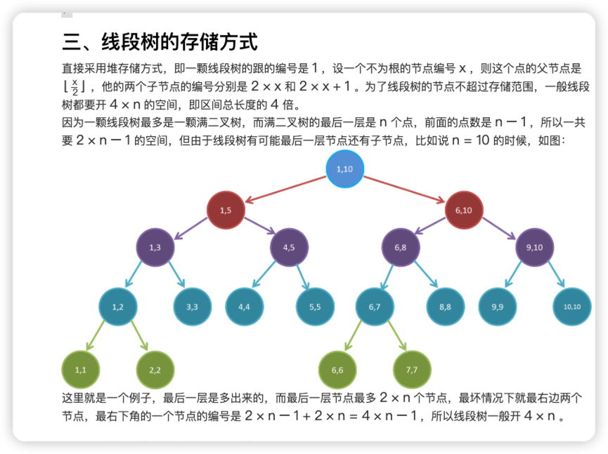
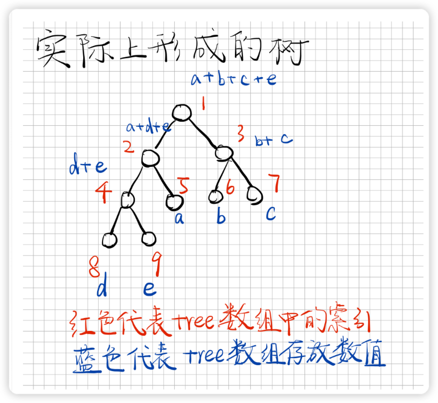
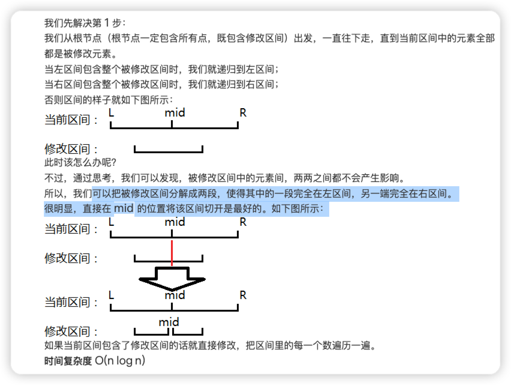
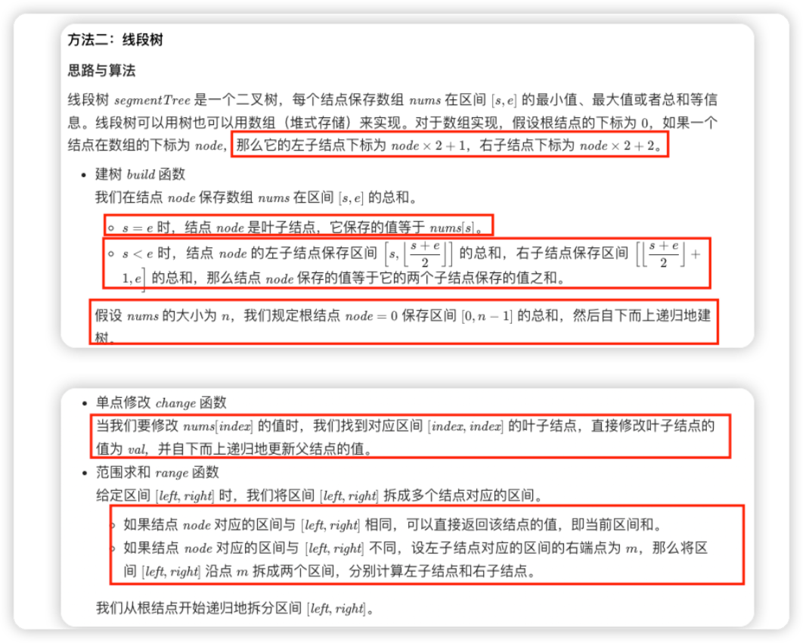

## 推荐阅读
// https://oi-wiki.org/ds/seg/
// https://cp-algorithms.com/data_structures/segment_tree.html
// 总结得比较详细 https://www.acwing.com/blog/content/1684/

## 一、线段树简介

线段树是算法竞赛中常用的用来维护区间信息的数据结构。
线段树segmentTree 是一个二叉树，每个结点保存数组nums 在区间 [s, e]的最小值、最大值或者总和等信息。
线段树可以在很小的时间复杂度内实现单点修改、区间修改、区间查询（即区间求和，求区间 maxmax ，求区间 minmin ，区间 GCDGCD 等）操作。
但是，线段树所维护的信息，需要满足区间加法。
区间加法：如果一个区间 [l,r][l,r]（线段树中一个点表示一个区间）满足区间加法的意思是一个区间 [l,r][l,r] 的线段树维护的信息（即区间最大值，区间最小值，区间和，区间 gcdgcd
等），可以由两个区间 [l,mid][l,mid] 和 [mid+1,r][mid+1,r] 合并而来。

二、线段树的基本概念
线段树，是一种基于分治思想的二叉搜索树。它支持的所有操作都可以 O(logn)O(log⁡n) 的时间复杂度完成。
但是线段树有个很大的特点：线段树的题目可以调上一整天
线段树的基本特点：

1. 线段树的每一个节点表示一个区间
2. 线段树有唯一根，这个根表示的所有会被线段树统计的总区间，一般情况下，跟表示的区间就是 [1,n][1,n]
3. 线段树的叶子节点表示的区间为 [x,x][x,x] ，且长度为 11
4. 线段树中如果一个节点表示的区间是 [l,r][l,r] ，且这个点不为叶子节点，即 l≠rl≠r，那么这个节点的左子树的根表示的区间就是 [l,mid][l,mid]
   这个节点的右子树的根表示的区间就是 [mid+1,r][mid+1,r]，其中 mid=⌊l+r2⌋mid=⌊l+r2⌋ 。







## 四、线段树的基本操作

### 1.1.建立线段树

思路
我们递归遍历初始区间，把遍历到的所有节点表示的区间记录下来，如果这个节点不是叶子节点（即区间长度大于11），那么就分别遍历左子树和右子树，否则就是叶子节点，不仅要把表示的区间记录下来，还要把线段树维护的信息也记录下来，维护的信息在叶子节点上基本上就是这个数本身。
时间复杂度 O(logn)

```python3
# 对节点u进行建树，[l,r]对应的左子树和右子树为[l,mid]，[mid+1,r]
def bulid(u, l, r):
    tree[u] = TreeNode(l, r)  # 当前正在下标为u的点，这个点表示的区间是[l,r]
    if l == r:
        return
    mid = l + r >> 1
    # u << 1就是u * 2，u << 1 | 1就是u * 2 + 1
    bulid(u << 1, l, mid)  # 递归建左子树
    bulid(u << 1 | 1, mid + 1, r)  # 递归建右子树
```

### 2.2.单点修改

思路
我们通过二分查找的形式找到要修改的点，然后把找的过程上的链都修改一下。
时间复杂度 O(logn)

```python3
#  当前这个点是下标为u的点 要把第a个数修改成x
def modify(u, a, x):
    #  如果当前区间只有一个数，那么这个数一定是要修改的。
    if tree[u].l == a and tree[u].r == a:
        tree[u].v = x
    else:
        mid = tree[u].l + tree[u].r >> 1
        # 如果在左边就递归修改左半边区间
        if a <= mid:
            modify(u << 1, a, x)
        # 如果在右边就递归修改右半边区间
        else:
            modify(u << 1 | 1, a, x)
        # 记得更新信息
        pushup(u)

# 根据子节点的信息，更新父节点u的信息
# 这里需要根据线段树维护的属性来写，如维护最大值，则取所有子节点的最大值更新父节点的最大值
def pushup(u):
    tree[u].v = max(tree[u << 1].v, tree[u << 1 | 1].v)
```

### 3.3.区间修改





> 线段树的所有操作同样为 O(log{n})，O(logn)，由于本题不涉及「区间修改」操作，因此我们的线段树只需要实现 pushup 操作（子节点往上更新父节点），而不需要实现用于懒标记的 pushdown
> 操作（父节点往下传递「更新」的操作）。

关于线段树设计的几种操作：



```java
void build(int u, int l, int r)：含义为从编号为 u 的节点开始，构造范围为 [l,r] 的树节点；
void update(int u, int x, int v)：含义为从编号为 u 的节点开始，在 x 位置增加 v；
更具一般性（涉及区间修改）的操作应该为 void update(int u, int l, int r, int v)，代表在 [l, r] 范围增加 v；
int query(int u, int l, int r)：含义为从编号为 u 的节点开始，查询 [l, r] 区间和为多少。
```

> 针对不同的题目，有不同的方案可以选择（假设有一个数组）：
   1. 数组不变，求区间和：「前缀和」、「树状数组」、「线段树」
   2. 多次修改某个数，求区间和：「树状数组」、「线段树」
   3. 多次整体修改某个区间，求区间和：「线段树」、「树状数组」（看修改区间的数据范围）
   4. 多次将某个区间变成同一个数，求区间和：「线段树」、「树状数组」（看修改区间的数据范围）


### [307. 区域和检索 - 数组可修改](https://leetcode.cn/problems/range-sum-query-mutable/) --线段树