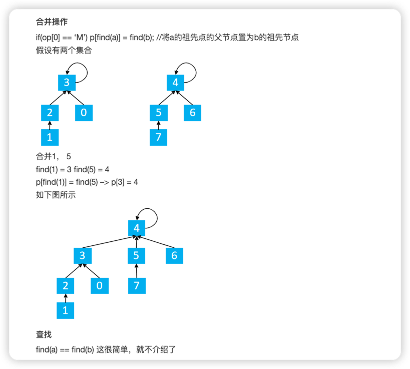

并查集，加入路径压缩，是无法降低到O(1)时间的（因为你使用了循环）。即使它的时间复杂度再低，你也只能说“几乎是O(1)”。毕竟严格来说，按秩合并的带路径压缩的并查集的UnionFind的时间复杂度应该是反阿克曼函数。
○ https://github.com/hakusai22/Go_Python_Study/blob/main/Algorithm/Algorithm_Questions_By_Tags/Data_Structure/Union_Find/%E5%B9%B6%E6%9F%A5%E9%9B%86.md
○ https://blog.csdn.net/yuzhiqiang666/article/details/80721436
○ https://worktile.com/kb/p/49374

> python3并查集模版

```python
N = 100010
p = [0] * N
size = [0] * N

# find函数，用于返回x的祖宗节点
# 同时压缩往回搜寻节点的路径
def find(x):
    if p[x] != x:
        p[x] = find(p[x])
    return p[x]

for i in range(1, n + 1):
    p[i] = i
    size[i] = 1

# 将a集合合并到b集合
size[find(b)] += size[find(a)]
# a的祖先的父节点=b的祖先
p[find(a)] = find(b)
```

# 按秩合并的带路径压缩的并查集的UnionFind的时间复杂度应该是反阿克曼函数。
- 对于一般可能出现的数值n，α(n)均小于5。

```python
class UnionFind:
    def __init__(self, n):
        self.parent = list(range(n))

    def find(self, x):
        if x != self.parent[x]:
            self.parent[x] = self.find(self.parent[x])
        return self.parent[x]

    def merge(self, a, b):
        root1, root2 = self.find(a), self.find(b)
        if root1 != root2:
            self.parent[root2] = root1
```

```python
class UnionFind:
    def __init__(self, n):
        self.parent = list(range(n))

    def find(self, a):
        acopy = a
        while a != self.parent[a]:
            a = self.parent[a]
        while acopy != a:
            self.parent[acopy], acopy = a, self.parent[acopy]
        return a

    def merge(self, a, b):
        self.parent[self.find(b)] = self.find(a)

```
